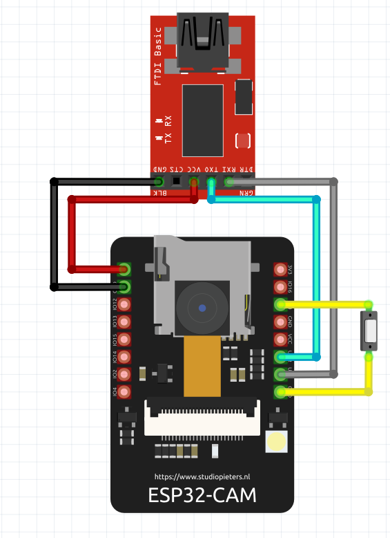
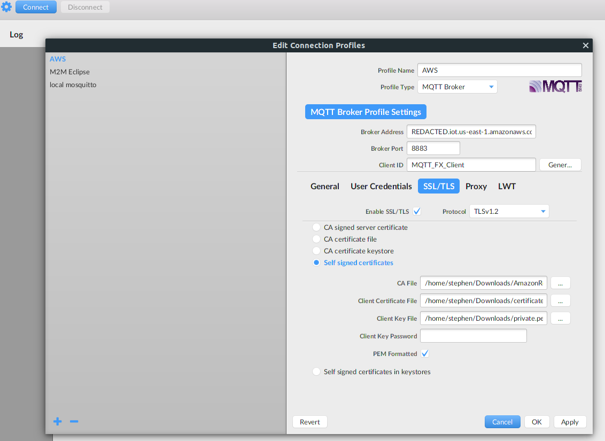

# AWS ESP 32 Cam


## Setup
[Download the AWS Root CA](https://www.amazontrust.com/repository/AmazonRootCA1.pem)

Create your AWS Certificates with
```
aws iot create-keys-and-certificate \
    --set-as-active \
    --certificate-pem-outfile <certificate_filename> \
    --public-key-outfile <public_key_filename> \
    --private-key-outfile <private_key_filename>
                            
```

Get your AWS IOT endpoint URl with ```aws iot describe-endpoint```

Modify ```lib/conf/conf.h``` with your variables.
Your certificates will need to be formatted with newline characters. For example your CA Certificate would look like.
```
const char CA_CERT[] ="-----BEGIN CERTIFICATE-----\n"
"MIIDQTCCAimgAwIBAgITBmyfz5m/jAo54vB4ikPmljZbyjANBgkqhkiG9w0BAQsF\n"
"ADA5MQswCQYDVQQGEwJVUzEPMA0GA1UEChMGQW1hem9uMRkwFwYDVQQDExBBbWF6\n"
--snip---
"-----END CERTIFICATE-----";
```

### Flashing Code
When flashing code you will need to hold the button connected to ```IO0``` and ```GND``` down. If you run into this issue then you will need to press the button on the back of the EPS32-CAM once.
```
Connecting........_____....._____....._____....._____....._____....._____....._____

A fatal error occurred: Failed to connect to ESP32: Timed out waiting for packet header
*** [upload] Error 2
```
### Monitoring Via Serial Port
When monitoring code via the serial port you will need to make sure the button between ```IO0``` and ```GND``` is not held down. If you still do not see anything then press the button on the back of the ESP32-CAM once.

### Monitoring MQTT topic
I tend to use [MQTT/.fx](https://mqttfx.jensd.de/) to monitor the MQTT topic without needed to log into AWS. You will need to include your ```Client Key File``` ```AWS Root CA``` and ```Client Certifiate File``` in your conection profile settings.



## References
[ESP32 Camera WebServer Code](https://github.com/espressif/arduino-esp32/tree/master/libraries/ESP32/examples/Camera/CameraWebServer)

[Fritzing ESP32-CAM Model](https://forum.fritzing.org/t/esp32-cam-fritzing-part/8517/3)